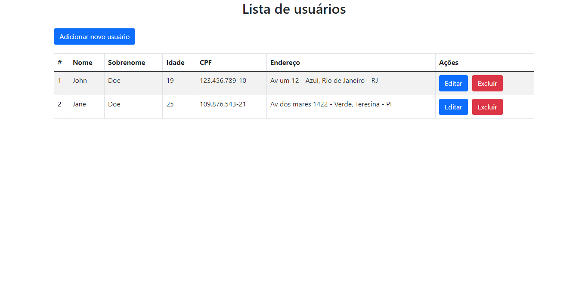
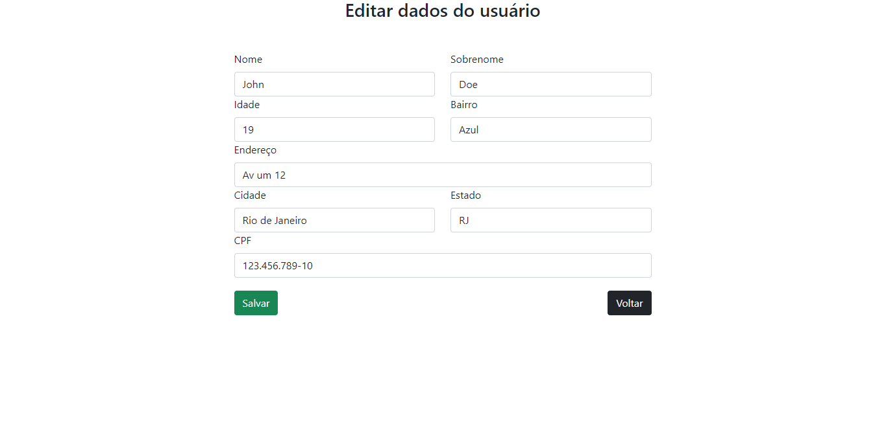
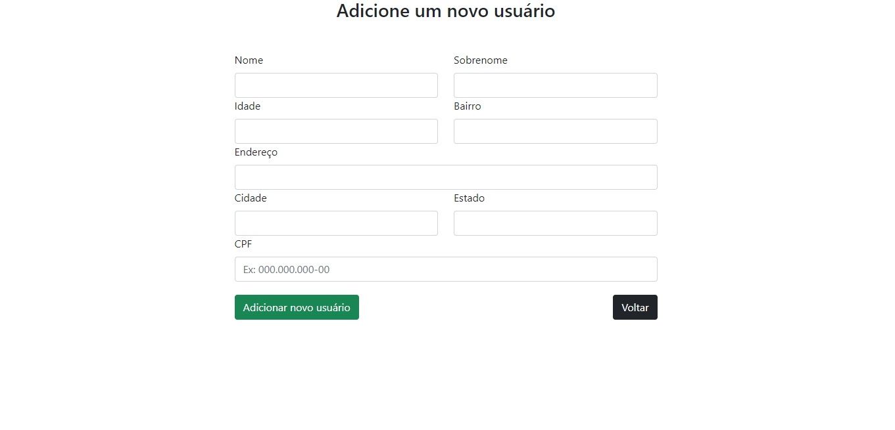

# Cadastro de usuários ( CRUD )
Projeto feito em typescript, redux para manipular o estado e hooks.  
Estou aprendendo typescript, por esse motvio existem algumas variáveis e propriedades que não estão devidamente tipadas.

## Como rodar
- clone o repositório: `git clone git@github.com:Doug-Fernando/Cadastro-usuario-crud.git`
- Navegue até a pasta onde clonou o projeto e execute: `npm install` ou `yarn`
- Após instalado as dependências, execute `npm start` ou `yarn start`
- O projeto deve abrir no navegador usando a porta padrão do react **3000**: [http://localhost:3000](http://localhost:3000)

### Tela inicial

### Editar dados do usuário

### Adicionar novo usuário

